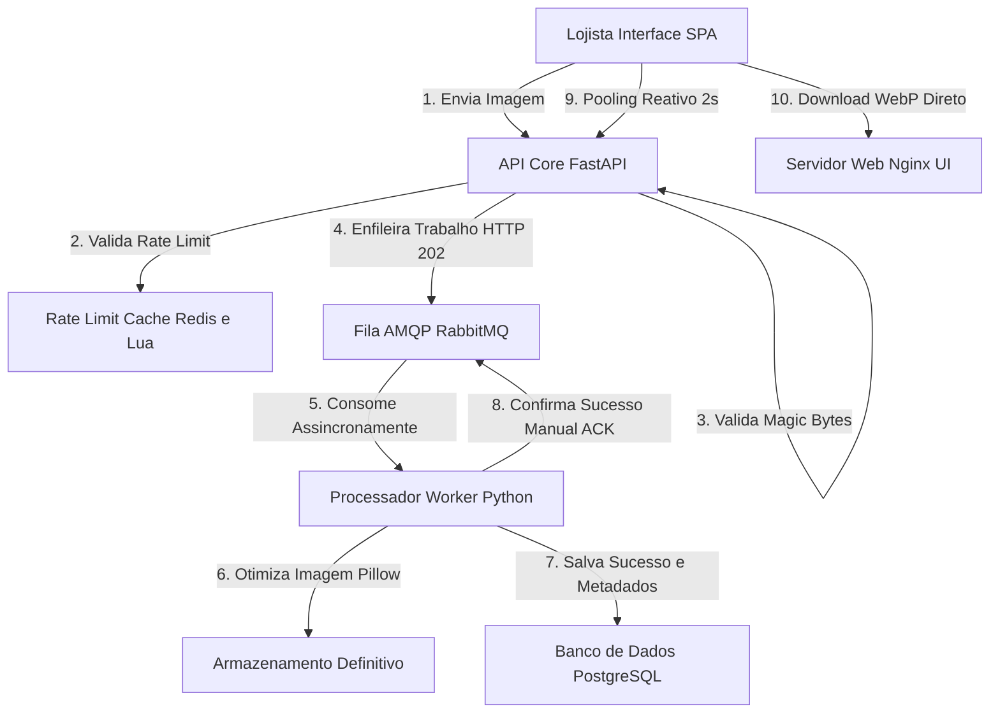

# ⚡ Esteira de Mídias: Ecossistema de Otimização Assíncrona e Resiliente

Bem-vindo ao repositório **Esteira de Mídias**! Este projeto é um ecossistema completo de microsserviços distribuídos de alto desempenho projetado para receber, validar fisicamente, enfileirar, processar e otimizar imagens de produtos de lojistas em alta velocidade e com **custo zero** de infraestrutura proprietária.

O sistema é 100% desenvolvido em arquitetura orientada a eventos (*event-driven*), escalável horizontalmente, monitorado ativamente e blindado contra ataques maliciosos ou falhas de hardware de ponta a ponta.

---

## 📐 1. Arquitetura de Microsserviços e Fluxo de Dados

O ecossistema é composto por microsserviços especializados que se comunicam de forma assíncrona por mensageria:



### 📦 Componentes do Ecossistema:
1.  **Interface do Lojista (Frontend SPA):** Console dinâmico e responsivo desenvolvido com design de alto luxo visual (*Sleek Dark* e *Glassmorphism*), contendo Dropzone inteligente com Drag & Drop, validações no cliente e painel de monitoramento reativo.
2.  **API Principal (Core HTTP):** Porta de entrada desenvolvida em FastAPI (Python), responsável por aplicar políticas de *Rate Limit* dinâmicas no Redis, validar a integridade física de assinaturas binárias (*Magic Bytes*) e registrar logs relacionais.
3.  **Broker de Mensageria (RabbitMQ):** Gerenciador de filas assíncronas persistentes que desacopla a recepção do processamento das imagens, garantindo resiliência contra oscilações de tráfego.
4.  **Processador de Mídias (Esteira Worker):** Microsserviço de segundo plano (*event-driven*) responsável por consumir as tarefas, ler a imagem, redimensionar em três formatos otimizados (Miniatura, Média e Alta Resolução) usando Pillow e salvá-los no formato WebP de alta eficiência compacta.
5.  **Bancos de Dados:** PostgreSQL para a persistência relacional estável de trabalhos e status, e Redis em cache rápido de memória para controle do middleware de controle de taxa de requisições.
6.  **Telemetria & Observabilidade:** Prometheus atuando na coleta contínua de métricas operacionais (/metricas) e painel Grafana para monitoramento em tempo real da saúde operacional.

---

## 🛠️ 2. Stack Tecnológica e Ferramentas

*   **Linguagem Principal:** Python 3.10+ (API e Worker).
*   **Web Framework:** FastAPI (API Core) com Uvicorn.
*   **Processamento Gráfico:** Pillow (Python Imaging Library).
*   **Mensageria:** RabbitMQ (AMQP Protocol) com biblioteca `pika`.
*   **Persistência Relacional:** PostgreSQL 15 com Driver `psycopg2`.
*   **Banco em Memória:** Redis 7 com execução de scripts Lua atômicos.
*   **Interface UI:** HTML5 / CSS3 Vanilla (Glassmorphism e Glow HSL) servido por Nginx Alpine.
*   **Telemetria:** Prometheus Server & Grafana Dashboards.
*   **Orquestração e DevOps:** Docker Compose (local) e manifestos declarativos do Kubernetes (produção no diretório `/k8s`).

---

## 🔒 3. Defesa Contínua e Blindagem de Segurança

O ecossistema é projetado sob os padrões corporativos de **Defesa em Profundidade (Defense-in-Depth)**:

1.  **Segurança Física de Imagens (Mime Security / Magic Bytes):** Bloqueia a infiltração de códigos maliciosos (*Webshells* ou cavalos de troia) camuflados com extensões falsas (ex: scripts renomeados para `.png`). Lemos os bytes físicos brutos em memória e rejeitamos arquivos inválidos antes mesmo do processamento.
2.  **Rate Limiting Dinâmico Atômico:** Middleware acoplado ao Redis executando scripts Lua. Garante proteção total contra ataques DDoS (*Distributed Denial of Service*) ou inundação de chamadas simultâneas sem sofrer com condições de corrida (*Race Conditions*).
3.  **RabbitMQ Manual ACKs:** Evita a perda de transações ou corrupção de imagens em caso de falha de hardware. O evento de otimização só é retirado da fila se o Worker concluir 100% da tarefa e persistir o sucesso no PostgreSQL.
4.  **Isolamento no Kubernetes:** No ambiente de produção `/k8s`, apenas os serviços da API e Frontend são expostos externamente via Ingress. O banco Postgres, cache Redis, broker Rabbitmq e o processador Worker rodam sob IPs privados sem acesso público direto da Internet.

---

## 🚀 4. Como Executar o Ecossistema Localmente

### Pré-requisitos:
*   Ter o [Docker Desktop](https://www.docker.com/products/docker-desktop/) instalado e rodando em sua máquina real.

### Execução Rápida com 1 Comando:
Navegue até a pasta raiz do repositório no seu terminal e execute:

```bash
docker compose up -d --build
```

O Docker compilará automaticamente as imagens dos microsserviços customizados e baixará as dependências necessárias, iniciando todo o ambiente em segundo plano de forma 100% integrada na rede interna `rede_esteira`!

---

## 🧪 5. Como Testar na Prática (Fluxo E2E)

Na raiz do repositório, você encontrará dois arquivos físicos de teste prontos que foram gerados para validar o ecossistema:
*   💾 **`produto_teste.png`:** Uma imagem legítima de teste válida.
*   💾 **`malware.png`:** Um arquivo de texto falso camuflado para simular ataques e validar as barreiras de segurança.

### Passo a Passo de Teste no Navegador:

1.  Abra a Interface do Lojista no seu navegador:
    👉 **[http://localhost:3000](http://localhost:3000)**
2.  **Validação da Barreira de Segurança:**
    *   Arraste e solte o arquivo **`malware.png`** na área do Dropzone.
    *   *Resultado:* O sistema bloqueia na hora! O painel exibe o status **`Falhou`** em vermelho e a mensagem física de cabeçalho inválido.
3.  **Validação de Otimização e Conversão WebP:**
    *   Arraste e solte o arquivo **`produto_teste.png`** na área do Dropzone.
    *   *Resultado:* O upload é aceito imediatamente. A tag passará por **`Pendente`** ➡️ **`Otimizando...`** ➡️ **`Concluído`** em verde neon.
    *   Os 3 botões estilizados de download WebP (**`Mini`**, **`Média`** e **`Alta`**) surgem na tabela de monitoramento reativo. Ao clicar em qualquer um deles, você visualiza a imagem redimensionada correspondente!

---

## 📈 6. Painéis Operacionais e Portas de Telemetria

Toda a infraestrutura ativa de produção e desenvolvimento pode ser acompanhada em tempo real através dos links e portas abaixo mapeadas no seu computador:

*   💻 **Console de Mídias (SPA Frontend):** [http://localhost:3000](http://localhost:3000)
*   ⚙️ **Swagger UI (Documentação da API FastAPI):** [http://localhost:8000/docs](http://localhost:8000/docs)
*   📈 **Telemetria do Prometheus:** [http://localhost:9090](http://localhost:9090)
*   📊 **Gráficos e Dashboards do Grafana:** [http://localhost:3001](http://localhost:3001) *(Senha padrão: admin)*
*   🐇 **Painel Administrativo do RabbitMQ:** [http://localhost:15672](http://localhost:15672) *(Login/Senha padrão: guest)*

---

## 📂 7. Estrutura de Diretórios do Repositório

```text
Esteira/
├── docs/                        # Documentos de Requisitos do Produto (PRD)
├── k8s/                         # Manifestos de Implantação Cloud-Native no Kubernetes
├── src/
│   ├── esteira-api/             # Código Fonte do Backend HTTP FastAPI
│   ├── esteira-worker/          # Código Fonte do Processador de Mídias Assíncrono
│   └── esteira-ui/              # Código Fonte da Interface SPA do Lojista (Nginx)
├── docker-compose.yml           # Orquestração do Ambiente Completo Local
├── prometheus.yml               # Configurações de Métricas de Telemetria do Prometheus
├── produto_teste.png            # Arquivo Legítimo de Teste E2E
├── malware.png                  # Arquivo Falso de Teste de Segurança
└── README.md                    # Manual Oficial do Projeto (Este Arquivo)
```

---

## 🏆 8. Conclusão e Propósitos Técnicos

Este repositório foi construído com fins de estudo e aprimoramento em arquiteturas Cloud-Native e Engenharia de Software escalável. Demonstra a aplicação prática de conceitos de vanguarda que resolvem gargalos de custos computacionais em empresas de comércio eletrônico, garantindo resiliência contra indisponibilidade de banco de dados e alto isolamento lógico de segurança contra fraudes binárias.
