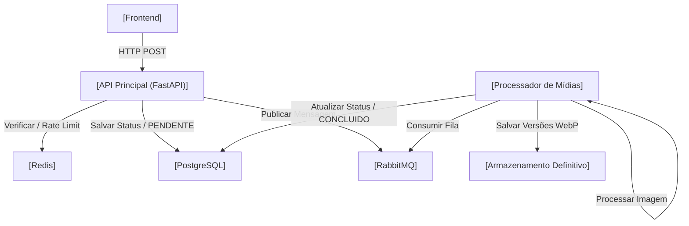

# Documento de Requisitos do Produto (PRD) - Backend Esteira de Mídias

Este documento detalha a arquitetura, endpoints, modelagem de dados e diretrizes de desenvolvimento para o ecossistema do **Backend da Esteira de Mídias**.

O ecossistema será dividido em dois componentes principais independentes (Microsserviços): a **API Principal** (síncrona/HTTP) e o **Processador de Mídias** (assíncrono/orientado a eventos).

---

## 1. Arquitetura e Fluxo de Dados

A arquitetura do sistema foi projetada de forma assíncrona para garantir alta resiliência e performance. Abaixo está a representação do fluxo de dados:



### Componentes:
*   **API Principal:** Valida a requisição, aplica *Rate Limit* (limitação de acessos) via Redis, salva o status `"PENDENTE"` no PostgreSQL, envia a imagem para o armazenamento temporário e publica uma mensagem no RabbitMQ.
*   **Processador de Mídias:** Consome a fila do RabbitMQ, processa a imagem (redimensionamento e conversão para WebP), salva as imagens finais no armazenamento definitivo e atualiza o status para `"CONCLUIDO"` no PostgreSQL.

---

## 2. Endpoints da API (FastAPI)

Todos os endpoints seguem o padrão RESTful e utilizam injeção de dependência nativa do FastAPI.

| Método | Endpoint | Descrição | Regras de Negócio / Segurança |
| :--- | :--- | :--- | :--- |
| `POST` | `/api/v1/autenticacao/token` | Geração de token JWT simulado para Lojistas. | Simula a autenticação do ecossistema Magalu. |
| `POST` | `/api/v1/midias/enviar` | Recebe a mídia bruta (Multipart Form). | **Controle de Taxa:** Máx 10 req/min por IP.<br>**Validação:** Máx 5MB. Apenas PNG/JPEG (via Magic Bytes). |
| `GET` | `/api/v1/midias/status/{id_trabalho}` | Consulta o status do processamento. | Retorna `PENDENTE`, `PROCESSANDO`, `CONCLUIDO` ou `FALHOU`. |
| `GET` | `/metricas` | Expõe métricas para o Prometheus. | Rota pública de telemetria (Uso de CPU, requisições, erros 5xx). |

---

## 3. Modelagem do Banco de Dados (PostgreSQL)

Utilizaremos **UUID v4** como chave primária para evitar a enumeração de IDs e garantir maior nível de segurança.

### Tabela: `trabalhos_esteira` (Gerenciamento do Pipeline)
Armazena a rastreabilidade e o estado atual de cada processo de conversão de mídia.

| Coluna | Tipo | Restrições | Descrição |
| :--- | :--- | :--- | :--- |
| `id` | `UUID` | `PRIMARY KEY` | Identificador único do pipeline de processamento. |
| `id_vendedor` | `UUID` | `FOREIGN KEY`, indexado | Identificador do lojista proprietário do recurso. |
| `nome_original` | `VARCHAR(255)` | `NOT NULL` | Nome original do arquivo enviado pelo usuário. |
| `status` | `VARCHAR(50)` | `NOT NULL` | Estado do trabalho: `PENDENTE`, `PROCESSANDO`, `CONCLUIDO`, `FALHOU`. |
| `mensagem_erro` | `TEXT` | `NULLABLE` | Mensagem descritiva caso o processamento falhe. |
| `criado_em` | `TIMESTAMP` | `WITH TIMEZONE` | Carimbo de data/hora de criação do registro. |
| `atualizado_em` | `TIMESTAMP` | `WITH TIMEZONE` | Carimbo de data/hora da última atualização. |

### Tabela: `assets_processados` (Metadados das Imagens Otimizadas)
Armazena as referências físicas e metadados das imagens após o processamento bem-sucedido.

| Coluna | Tipo | Restrições | Descrição |
| :--- | :--- | :--- | :--- |
| `id` | `UUID` | `PRIMARY KEY` | Identificador único da imagem otimizada. |
| `id_trabalho` | `UUID` | `FOREIGN KEY` (Cascade Delete) | Relacionamento com a tabela `trabalhos_esteira`. |
| `tipo_resolucao`| `VARCHAR(50)` | `NOT NULL` | Tipo da resolução gerada: `MINIATURA`, `MEDIA`, `GRANDE`. |
| `caminho_arquivo`| `VARCHAR(512)` | `NOT NULL` | Caminho local simulando o bucket de armazenamento definitivo. |
| `tamanho_arquivo_bytes`| `INTEGER` | `NOT NULL` | Tamanho final do arquivo otimizado em bytes. |
| `criado_em` | `TIMESTAMP` | `WITH TIMEZONE` | Data e hora de processamento do asset. |

---

## 4. Estratégia de Segurança e Resiliência

Para pontuar alto nos requisitos de segurança recomendados para infraestruturas robustas:

> [!IMPORTANT]
> **Sliding-Window Rate Limiting (Redis)**
> Utilizar um script Lua no Redis para garantir atomicidade. Se o IP do cliente estourar o limite, a API retorna imediatamente `HTTP 429 Too Many Requests` sem realizar requisições ou tocar no banco de dados PostgreSQL.

> [!WARNING]
> **Validação de Cabeçalho de Arquivo - Magic Bytes (Anti-Malware)**
> Não confiaremos apenas na extensão `.jpg` ou `.png` enviada no cabeçalho pelo usuário. O backend lerá os primeiros 4 bytes do arquivo (*Magic Bytes*) usando a biblioteca `python-magic` ou leitura direta de buffers para validar se o cabeçalho representa realmente uma imagem válida.

> [!NOTE]
> **Limite do Tamanho da Requisição (Payload Limit)**
> Configuração no FastAPI para rejeitar uploads maiores que 5MB direto na camada de requisição, evitando estouro de memória (*Memory Exhaustion Attacks*).

---

## 5. Arquitetura de Código (Padrão de Projeto)

O repositório do backend adotará os princípios da **Arquitetura Limpa (Clean Architecture)**, estruturando-se de forma organizada e com termos em português do Brasil:

```text
src/
├── dominio/            # Entidades de negócio puras (regras puras)
├── casos_de_uso/       # Lógica da aplicação (ex: CasoDeUsoEnviarMidia)
├── infraestrutura/     # Detalhes técnicos (Conexão DB, RabbitMQ, Redis)
└── interfaces/         # Controladores HTTP (FastAPI) e Consumidores da Fila
```

> [!TIP]
> **Por que isso é importante?**
> Demonstra domínio profundo de *Design Patterns* e isolamento de escopo. Se futuramente decidirmos trocar o banco PostgreSQL por um MongoDB, apenas a camada de `infraestrutura` precisará de modificações; as regras de negócio em `dominio` permanecerão intocadas.

---

## 6. Estratégia de Testes Automatizados (Pytest)

*   **Testes Unitários:** Validar se as entidades de domínio e os casos de uso (*casos_de_uso*) se comportam corretamente (ex: verificar se o status muda para `FALHOU` se o processador de imagem lançar uma exceção simulada).
*   **Testes de Integração:** Usar um banco de dados PostgreSQL em container de teste (via *Testcontainers* ou fixture do Docker) e o cliente de testes do FastAPI para disparar um upload real de uma imagem válida e capturar o retorno esperado `HTTP 202 Accepted`.
