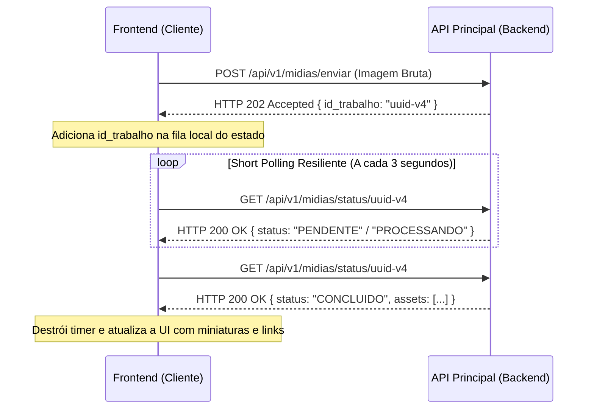

# Documento de Requisitos do Produto (PRD) - Frontend Esteira de Mídias

Este documento detalha os requisitos da interface, experiência do usuário (UX), stack tecnológica e comportamento em tempo real do **Frontend da Esteira de Mídias**.

O frontend será uma aplicação de página única (**SPA**) ou estruturada via **SSR/Static**, atuando como o console de gerenciamento de mídias do lojista.

---

## 1. Experiência do Usuário (Fluxo de Telas)

A interface será composta por uma única tela principal, focada em simplicidade e usabilidade operacional, dividida em duas seções estratégicas:

*   **Área de Upload (Drag and Drop):** Um componente central onde o lojista pode arrastar múltiplos arquivos ou clicar para abrir o selecionador local do sistema operacional.
*   **Lista de Trabalhos (Painel de Monitoramento):** Uma tabela ou grade (*grid*) de cartões exibindo todos os uploads feitos, seus respectivos status em tempo real e os links diretos para visualização e cópia das mídias otimizadas assim que forem geradas.

---

## 2. Requisitos Funcionais e Componentes

### Componente A: Dropzone de Upload

*   **Comportamento:** Permitir a seleção de múltiplos arquivos de imagem simultaneamente, limitando ao máximo de 5 arquivos por vez.
*   **Pré-validação (Segurança no Cliente):** 
    O frontend deve bloquear imediatamente o upload antes do envio caso o arquivo ultrapasse o tamanho de **5MB** ou se a extensão não for exatamente `.png` ou `.jpeg`/`.jpg`.

> [!IMPORTANT]
> **Por que a pré-validação importa?**
> Isso evita o desperdício de banda de rede do cliente e do servidor, rejeitando payloads nitidamente inválidos antes de iniciar conexões de rede custosas com a API.

### Componente B: Lista de Status da Esteira

Exibição dos cartões dinâmicos de arquivos enviados, variando o comportamento e o estilo visual conforme o status retornado pela rota `/api/v1/midias/status/{id_trabalho}`:

| Status da API | Comportamento Visual | Elementos Gráficos | Ações Disponíveis |
| :--- | :--- | :--- | :--- |
| 🟡 `PENDENTE` / `PROCESSANDO` | Cartão com bordas amarelas ou neutras. | *Spinner* de carregamento e texto: *"Otimizando imagem nas nuvens..."* | Sem ações físicas. |
| 🟢 `CONCLUIDO` | Cartão verde com bordas suaves. | Ícone de sucesso e renderização de 3 miniaturas (*Miniatura*, *Média*, *Grande*). | Botões individuais de **"Copiar URL"** para a área de transferência. |
| 🔴 `FALHOU` | Cartão vermelho ou alerta. | Ícone de erro/alerta e mensagem amigável (ex: *"Arquivo corrompido"*). | Botão para tentar o upload novamente. |

---

## 3. Integração e Comunicação (Estratégia de Polling)

Como a arquitetura do backend é assíncrona (orientada a eventos), a imagem não estará pronta na resposta inicial de upload. Em vez de aguardar uma conexão bloqueante, o frontend recebe imediatamente um `id_trabalho` no formato UUID.

O ciclo de vida da verificação assíncrona está modelado abaixo:

*   **Mecanismo de Fila Local:** Ao receber a resposta `HTTP 202 Accepted`, o frontend armazena o `id_trabalho` no estado reativo (`useState` / Contexto).
*   **Short Polling Resiliente:** Dispara requisições `GET` automáticas a cada **3 segundos** para os trabalhos pendentes de finalização.
*   **Parada Inteligente:** No momento em que a API responder com `CONCLUIDO` ou `FALHOU`, o *timer* de requisição correspondente àquele `id_trabalho` é destruído imediatamente, liberando memória e processamento do navegador.

---

## 4. Stack Tecnológica Recomendada

Para garantir performance nativa, facilidade de hospedagem gratuita (ex: Vercel, Netlify) e alinhamento profissional:

*   **Framework:** **Next.js (App Router)** ou **React (Vite)**. *Dica:* Next.js é altamente valorizado em ambientes de grandes empresas como a Magalu por simular arquiteturas corporativas robustas.
*   **Estilização:** **Tailwind CSS**, permitindo interfaces rápidas, responsivas e profissionais de forma declarativa, sem a necessidade de pacotes pesados de componentes terceiros.
*   **Cliente HTTP:** **Axios** ou **Fetch API** nativa utilizando *interceptors* para anexar o token JWT simulado de forma transparente em todas as requisições autenticadas.
*   **Ícones:** **Lucide React** (ícones de engrenagem, nuvem, sucesso, falha), garantindo leveza no pacote final (*bundle*).

---

## 5. Requisitos Não-Funcionais (Foco em Qualidade)

> [!WARNING]
> **Tratamento de Erros de Rede**
> Caso a API Principal do backend fique indisponível temporariamente, o frontend não pode quebrar ou travar a tela. Deve aplicar uma estratégia de re-tentativa (*retry*) em segundo plano ou apresentar um aviso visual claro: *"Instabilidade na rede, tentando reconectar..."*.

> [!NOTE]
> **Gerenciamento de Estado Limpo**
> Isolamento de lógica operacional usando o React Context API ou ganchos customizados (*Custom Hooks*) como `usarEnvioDeMidia` (em substituição a `useMediaUpload`), mantendo a camada visual de componentes puramente focada em renderização e estilos.

---

## 6. Estratégia de Testes (Frontend)

Mesmo o foco técnico principal da vaga sendo Cloud e Backend, a presença de testes no frontend demonstra capricho técnico de ponta a ponta.

*   **Ferramentas:** **Vitest** + **React Testing Library**.
*   **Cenário de Teste Crítico (Segurança no Cliente):**
    Simular a interação do usuário ao selecionar um arquivo grande de **10MB** no componente de upload. O teste deve assegurar que a mensagem de erro *"Arquivo excede o limite de 5MB"* é exibida na interface reativa e que nenhuma chamada HTTP de upload foi disparada pelo serviço de rede.
